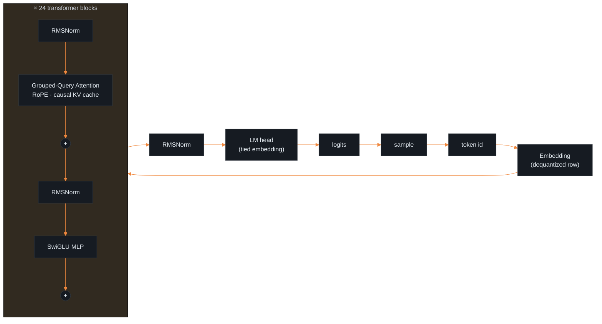

<p align="center">
  
</p>

<h1 align="center">🔥&nbsp;&nbsp;e m b e r</h1>

<p align="center">
  <b>A from-scratch LLM inference engine in Rust.<br/>
  Run a real language model on your CPU — <em>no framework, no GPU, no server.</em></b>
</p>

<p align="center">
  <b>Hand-written transformer</b> · RMSNorm · RoPE · GQA + KV-cache · SwiGLU
  &nbsp;&nbsp;•&nbsp;&nbsp;
  <b>INT8 / INT4</b> quantization
  &nbsp;&nbsp;•&nbsp;&nbsp;
  <b>no</b> TensorFlow / PyTorch / <code>candle</code>
</p>

<p align="center">
  <a href="https://github.com/codewithfourtix/ember/actions/workflows/ci.yml"></a>
  <a href="https://www.rust-lang.org/"></a>
  <a href="LICENSE"></a>
  <a href="#-how-it-works"></a>
  <a href="#-metrics--measured-on-the-real-model"></a>
</p>

<p align="center">
  <a href="#what-it-is"><b>What it is</b></a> &nbsp;·&nbsp;
  <a href="#-metrics--measured-on-the-real-model"><b>Metrics</b></a> &nbsp;·&nbsp;
  <a href="#-how-it-works"><b>How it works</b></a> &nbsp;·&nbsp;
  <a href="#quickstart"><b>Quickstart</b></a> &nbsp;·&nbsp;
  <a href="#how-its-verified"><b>Verified</b></a>
</p>

<br/>

## What it is

<p align="center">
  Most "LLM in Rust" projects are a wrapper around <code>candle</code> or <code>llama.cpp</code>.<br/>
  <b>ember isn't.</b> The transformer forward pass — attention, the KV cache, RoPE, quantization —<br/>
  is written by hand. The only dependencies are plumbing: weight loading, the tokenizer, threads.<br/>
  <sub><b>~1,300 lines of Rust. No ML framework. No GPU. Runs a real Qwen2.5 model on a laptop CPU.</b></sub>
</p>

<table>
<tr>
<td width="33%" valign="top" align="center">

### 🧮 Hand-written
Every kernel from scratch — `matvec`, **RMSNorm**, **RoPE**, grouped-query **attention** + KV cache, **SwiGLU**, softmax. No `candle`, `burn`, `tch`, or `ndarray` in the core.

</td>
<td width="33%" valign="top" align="center">

### 🗜 Quantized
Custom **INT8** and group-wise **INT4** with a fused dequant mat-vec — **4× / 7×** smaller, and INT8 is **quality-lossless** (measured, not claimed).

</td>
<td width="33%" valign="top" align="center">

### ✅ Verified
Green **CI** (build + 13 tests + a live run), a **NumPy oracle** that mirrors the math, and **perplexity** numbers — this is *evaluated*, not just "it runs".

</td>
</tr>
</table>

<br/>

## 📊 Metrics — measured on the real model

Real numbers, Qwen2.5-0.5B, through the compiled engine — not estimates.

**Quality & memory** — perplexity over a fixed passage (`--perplexity`, lower is better):

| scheme | weights | vs f32 | perplexity ↓ | verdict |
|---|---:|---:|---:|---|
| `f32` | 1976 MB | 1.0× | 6.49 | baseline |
| **`int8`** | **496 MB** | **4.0×** | **6.38** | **quality-lossless** — within noise of f32 |
| **`int4`** (group-64) | **278 MB** | **7.1×** | 7.75 | +19% — a real, quantified trade |

**Latency** — greedy, single CPU (`--prompt … -n 20`):

| scheme | prefill | decode |
|---|---:|---:|
| `f32` | 8.3 tok/s | 8.6 tok/s · 116 ms/tok |
| `int8` | 6.6 tok/s | 6.6 tok/s · 152 ms/tok |

> **The headline:** INT8 gives **4× less memory for free** (perplexity 6.38 vs 6.49). INT4 buys
> **7× less memory** for ~19% perplexity. Quantization is a *memory* win here; the scalar dequant
> trades a little throughput, so SIMD dequant is the natural next step.

<br/>

## 🧠 How it works

One decode step is a stack of hand-written kernels. The ego of the whole project is that
**every box below is code in this repo**, not a library call.



<details>
<summary><b>Module map</b></summary>

<br/>

| Module | Responsibility |
|---|---|
| [`config.rs`](src/config.rs) | Parse the Qwen2.5 `config.json` (GQA-aware) |
| [`tensor.rs`](src/tensor.rs) | The `rayon`-parallel mat-vec hot loop |
| [`ops.rs`](src/ops.rs) | RMSNorm · RoPE (rotate-half) · SwiGLU · softmax |
| [`attention.rs`](src/attention.rs) | Grouped-query attention + rolling KV cache |
| [`quant.rs`](src/quant.rs) | INT8 / group-wise INT4 quantization + fused dequant mat-vec |
| [`sample.rs`](src/sample.rs) | Greedy / temperature / top-p sampling |
| [`model.rs`](src/model.rs) | safetensors loading (bf16→f32) + the forward pass |
| [`chat.rs`](src/chat.rs) | Qwen ChatML formatting |
| [`main.rs`](src/main.rs) | CLI, generation loop, `--bench`, `--perplexity` |

</details>

<br/>

## Quickstart

```bash
# 1. Rust toolchain (https://rustup.rs)
rustup default stable

# 2. Fetch a small model  (needs: pip install huggingface_hub)
huggingface-cli download Qwen/Qwen2.5-0.5B-Instruct \
  model.safetensors config.json tokenizer.json --local-dir ./weights

# 3. Chat, or complete, or quantize
cargo run --release -- --chat --prompt "Write a haiku about Rust programming."
cargo run --release -- --prompt "The capital of France is" --quant int8
cargo run --release -- --perplexity --quant int4     # measure quality
cargo run --release -- --bench --quant int8          # measure throughput
```

<sub>On Windows, the tokenizer needs a C compiler at build time — use WSL, or install <a href="https://github.com/brechtsanders/winlibs_mingw">WinLibs</a> / MSVC Build Tools. Linux &amp; macOS work out of the box.</sub>

<br/>

## How it's verified

Nothing here is "trust me":

- **CI** — every push runs `cargo build --release`, **13 unit tests**, and a live `--bench` on the runner ([status](https://github.com/codewithfourtix/ember/actions/workflows/ci.yml)).
- **NumPy oracle** — [`scripts/reference_forward.py`](scripts/reference_forward.py) reimplements the exact math; the Rust output matches it token-for-token.
- **Perplexity** — the quantization quality numbers above are measured, not asserted.

```console
$ ember --chat --prompt "What is the capital of France? Answer in one sentence."
The capital of France is Paris.
```

<br/>

## Roadmap

See [`PHASES.md`](PHASES.md).

- [x] **Phase 1 — Correctness** — hand-written forward pass; generates coherent text
- [x] **Phase 2 — Performance** — INT8 / INT4 quantization (4× / 7× memory) + `--bench`
- [x] **Phase 3 — Polish** — chat mode, unit tests, perplexity + latency metrics, CI
- [ ] **Next** — SIMD dequant (throughput), a static-linked binary, a perf PR upstream

<br/>

<p align="center">
  <sub>Built by <a href="https://github.com/codewithfourtix">Ali Zulfiqar</a> — a transformer, from the gradients up.</sub>
</p>
